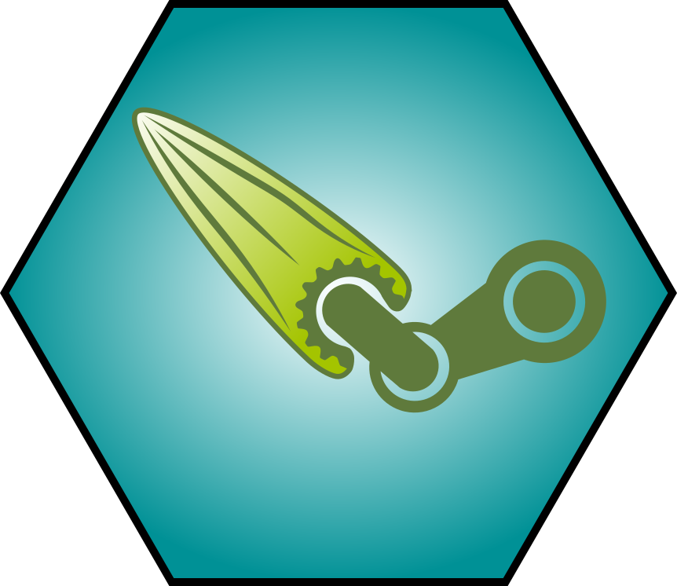

# Package utilitaire ecotools 

Package utilitaire développé et utilisé en interne par l'équipe Ecovea (IRSTEA/EABX)

<Présentation des principales fonctions>

Pour en savoir plus : https://davidcarayon.github.io/ecotools/

