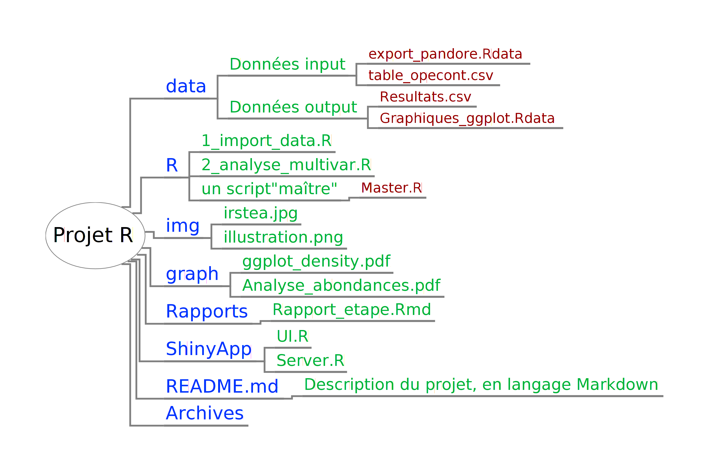

# Bonnes pratiques de projet
- Travailler autant que possible avec les projets Rstudio, cela permet de se passer du `setwd()` en début de script.
- Architecture classique : data (avec données d'input/output), R (contient les scripts), img pour les images diverses, graph pour les sorties graphiques.
- Eventuellement : Archives, README.md, Rapports (avec des .Rmd), ShinyApp
- Nommage des scripts : compartimentés par opération et numérotés : "1_import_data","2_analyse_multivar"...
- Un script "master" pour "sourcer" tous les autres scripts d'un coup.
- Le dossier de projet est géré en Git, du coup le README sera inteprété sous Github

# IDE possibles
- Rstudio : L'IDE le plus abouti pour faire de la bonne data science avec R
- Eclipse
- Atom.io : éditeur multi-langage open source issu des équipes derrière Github.

# Version tracking et compréhension

- Github

- Un cachier de labo au format .rmd peut aussi être intéréssant.

# Recherche d'une chaîne de charactère dans tous les scripts

- Utiliser le logiciel [http://astrogrep.sourceforge.net/download/](Astrogrep)
- Equivalent sous linux : gnome-regexxer
